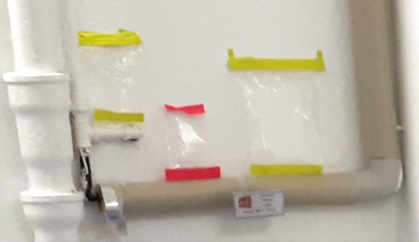

# Virtual Gas Camera Repository
This is the software repository for the so-called 'virtual gas camera' associated with the paper 'Robotic Scanning Absorption Spectroscopy for Methane Leak Detection: the Virtual Gas Camera'.

**If you use code from this repo or base your work on it**, we kindly ask you to include a citation to our paper 'Robotic Scanning Absorption Spectroscopy for Methane Leak Detection: the Virtual Gas Camera'. Detailed reference information will be added when the paper has been published.

The documentation will be extended prior to paper publication, but the published code is already operational. Still you should consider this repo a work-in-progress at the moment. The code is ecperimental in any case and comes with no warranty whatsoever.

In case of bugs, problems, or questions feel free to open an [issue](https://github.com/BAMresearch/virtual-gas-camera/issues/new).

# Overview
The virtual gas camera is a software project which allows users of typical gas tomography systems, e.g. gimbal-mounted tunable diode laser absorption spectroscopy (TDLAS) sensors with a video camera, to extend their setup with gas-camera-like capabilities. Below is an example of a measurement where the virtual gas camera idetifies two bags filled with methane (yellow). The middle bag (red) is a control with air.

Apart from the generation of overlay images in the field, the virtual gas camera also provides a live video feed. For details please see the paper: *(TODO: add link when paper is published*). A typical field measurement is shown below.

# Getting Started
## Prerequisites
* Laser Falcon TDLAS methane sensor (you could in principle rewrite the laserfalcon library with your own sensor library)
* SimpleBGC Gimbal Controller (you could in principle rewrite the simplebgc library with your own controller library)
* Video Grabber connected to you camera and compatible with OpenCV2
* Linux PC (we used Ubuntu 22.04.3)
* VLC player and SSH access from a second PC for monitoring and control

*TODO: pip requirements, vlc setup, usage*

# Achnowledgements
This code uses the simplebgc library which is Copyright (c) 2019 Michael Maier under MIT license. See readme in the subfolder and/or https://github.com/maiermic/robot-cameraman/tree/master for more information.
